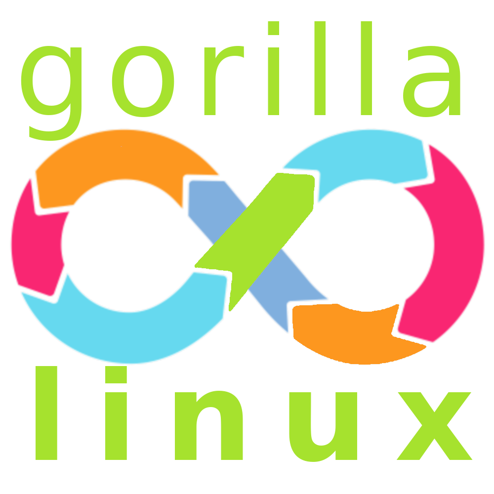

 

Hello friends,  
this is the beginning of a new Archlinux based distribution called `gorillalinux`.  
Eric Dubois from Arcolinux inspired me to do this with his wonderful projects.  
The goals will evolve I think. I start a first attempt here.

- If possible all tools should be programmed in rust.
- Use open source tools for Linux, which are programmed in rust. These are for example alacritty, starship, lsd and some more.
- `gorillalinux` should be installable with the graphical installer Calamares.
